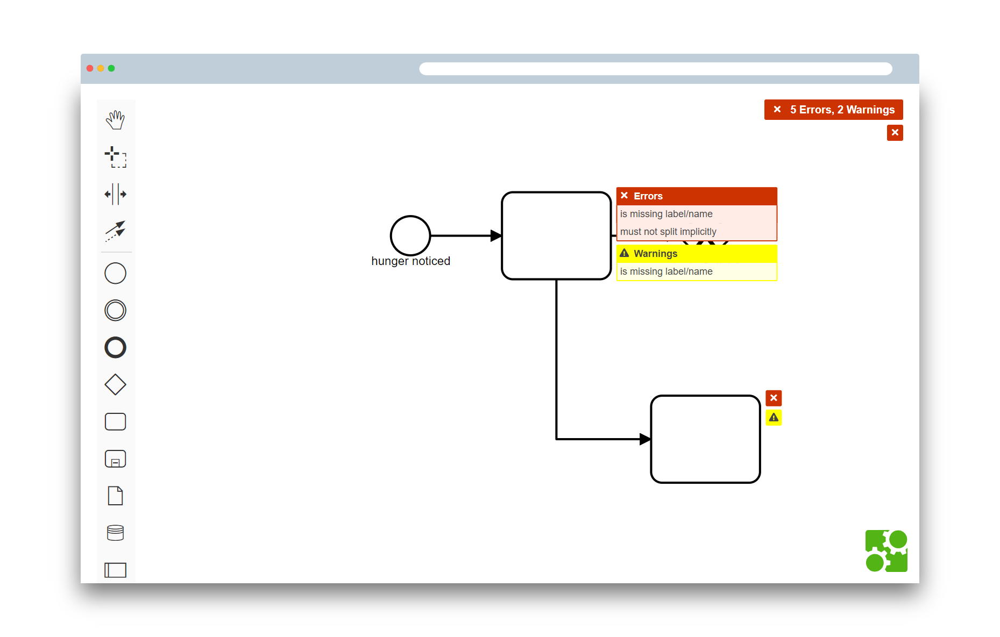

# bpmn-js-bpmnlint

[](https://travis-ci.com/bpmn-io/bpmn-js-bpmnlint)

Integrates [bpmnlint](https://github.com/bpmn-io/bpmnlint) into [bpmn-js](https://github.com/bpmn-io/bpmn-js).



See this extension in action as part of the [bpmnlint playground](https://github.com/bpmn-io/bpmnlint-playground).


## Usage

Integrate the linter into [bpmn-js](https://github.com/bpmn-io/bpmn-js):

```javascript
import lintModule from 'bpmn-js-bpmnlint';

import BpmnModeler from 'bpmn-js/lib/Modeler';

import bpmnlintConfig from './.bpmnlintrc';

var modeler = new BpmnModeler({
  linting: {
    bpmnlint: bpmnlintConfig
  },
  additionalModules: [
    lintModule
  ]
});
```


## Bundle Lint Rules

Use an appropriate plugin/loader for your module bundler (cf. [rollup-plugin-bpmnlint](https://github.com/nikku/rollup-plugin-bpmnlint), [bpmnlint-loader](https://github.com/nikku/bpmnlint-loader)) to bundle the bpmnlint configuration directly with your application as [shown above](#usage).

Alternatively, pack your local `.bpmnlintrc` file using the [bpmnlint-pack-config](https://github.com/nikku/bpmnlint-pack-config) utility:

```shell
bpmnlint-pack-config -c .bpmnlintrc -o bundled-config.js
```


## Plug-in Lint Rules

Provide the [packed lint rules](#bundle-lint-rules) via the `linting.bpmnlint` option. You may set it dynamically, too:

```javascript
var linting = modeler.get('linting');

linting.setLinterConfig(bpmnlintConfig);
```


## Resources

* [Issues](https://github.com/bpmn-io/bpmn-js-bpmnlint/issues)
* [Playground Project](https://github.com/bpmn-io/bpmnlint-playground)


## Development Setup

```
npm install
npm run dev
```


## License

MIT
