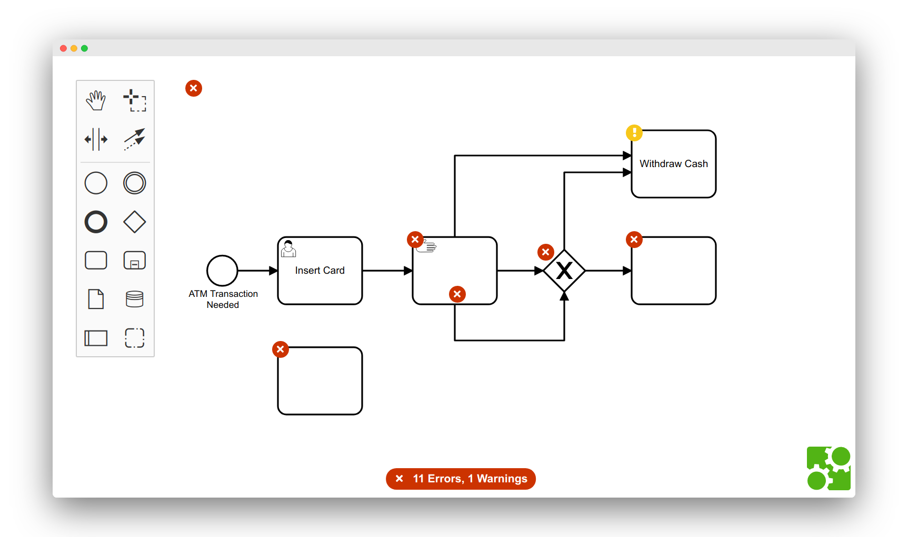

# bpmn-js-bpmnlint

Integrates [bpmnlint](https://github.com/bpmn-io/bpmnlint) into [bpmn-js](https://github.com/bpmn-io/bpmn-js).




## Usage

Integrate the linter into [bpmn-js](https://github.com/bpmn-io/bpmn-js):

```javascript
import lintModule from 'bpmn-js-bpmnlint';

import BpmnModeler from 'bpmn-js/lib/Modeler';

import bpmnlintConfig from './bundled-config';

var modeler = new BpmnModeler({
  linting: {
    bpmnlint: bpmnlintConfig
  },
  additionalModules: [
    lintModule
  ]
});
```


## Configure Lint Rules

When instantiating bpmn-js you _must_ use the `linting.bpmnlint` option to provide lint rules and their configuration.
The option takes a packed bpmnlint configuration which you may create from your local `.bpmnlintrc`
by using the [bpmnlint-pack-config](https://github.com/nikku/bpmnlint-pack-config) utility:

```shell
bpmnlint-pack-config -o bundled-config.js
```

Include the resulting `bundled-config.js` in your application and pass it to bpmn-js on instantiation as [shown above](#usage).

__Note:__ Do not forget to re-pack the configuration on lint rule changes.


## Resources

* [Issues](./issues)
* [Example](./example)


## Development Setup

```
npm install && npm run dev
```


## License

MIT